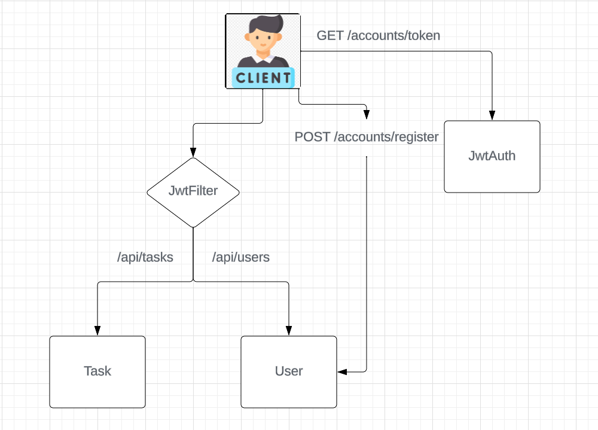

# JobOffers - Backend
The JobOffers backend is a secure platform that allows users to
to access job offers by authenticating themselves.
It also allows users to create their own job offers.
offers. It also contains a scheduler that updates
offers from an external API every 3 hours.
In addition, the application uses Redis caching for
optimised performance and faster data retrieval.

## Architecture



## Endpoints

| Endpoint                                                  |  Method  | Request                                                                                    | Response                          | Function                                                | Authorization                                |
|-----------------------------------------------------------|:--------:|:-------------------------------------------------------------------------------------------|-----------------------------------|---------------------------------------------------------|----------------------------------------------|
| `/accounts/token`                                         |  `GET`   | JSON BODY (email<br/>password)                                                             | JSON BODY (id, email, token)      | authenticate user                                       | *                                            |
| `/accounts/register`                                      |  `POST`  | JSON BODY (<br/>firstName,<br/>LastName<br/>email<br/>password, role)                      | JSON BODY (message)               | create admin                                            | *                                            |
| `/api/tasks`                                              |  `GET`   | -                                                                                          | JSON BODY (List<TaskDto>)         | show all tasks                                          | ADMIN, MANAGER                               |
| `/api/tasks`                                              |  `POST`  | JSON BODY (title, description, endDate, assignedTo                                         | JSON BODY (TaskDto)               | create task                                             | ADMIN, MANAGER                               |
| `/api/tasks/employee/{id}`                                |  `GET`   | -                                                                                          | JSON BODY (List<TaskDto>)         | show all of specified employee task                     | ADMIN, MANAGER, EMPLOYEE(If it is his tasks) |
| `/api/tasks/{id}`                                         |  `GET`   | -                                                                                          | JSON BODY (TaskDto)               | show task by id                                         | ADMIN, MANAGER, EMPLOYEE(If it is his tasks) |
| `/api/tasks/{id}`                                         |  `PUT`   | JSON BODY (title, description, endDate, assignedTo                     JSON BODY (TaskDto) | JSON BODY (TaskDto)               | update task                                             | ADMIN, MANAGER                               |
| `/api/tasks/{id}`                                         | `DELETE` | -                                                                                          | JSON BODY (TaskDto)               | delete  task  by id                                     | ADMIN, MANAGER                               |
| `api/tasks/{id}/complete`                                 | `PATCH`  | -                                                                                          | JSON BODY (message)               | mark task as complete                                   | EMPLOYEE                                     |
| `/api/users`                                              |  `GET`   | -                                                                                          | JSON BODY (List<UserDto>)         | show all users                                          | ADMIN                                        |
| `/api/users`                                              |  `POST`  | JSON BODY (firstName, LastName, email, password, role)                                     | JSON BODY (UserDto)               | create user (manager or employee)                       | ADMIN                                        |
| `/api/users/{id}`                                         |  `PUT`   | JSON BODY (firstName, LastName, email, password, role)                                     | JSON BODY (UserDto)               | update user's data                                      | ADMIN                                        |
| `/api/users/{id}`                                         |  `GET`   | -                                                                                          | JSON BODY (UserDto)               | show user by id                                         | ADMIN                                        |
| `/api/users/{id}`                                         | `DELETE` | -                                                                                          | JSON BODY (UserDto)               | delete user by id                                       | ADMIN                                        |
| `/api/users/stats/sorted-by-completed-tasks?lastMonths=1` |  `GET`   | -                                                                                          | JSON(List<EmployeeStatisticsDto>) | show how many tasks each user completed in `lastMonths` |                                              |


## Technologies


## How to build the project on your own
1. Clone this repository
```shell
git clone https://github.com/FuuKowatty/TaskManager-Backend.git
```
2. Go to the folder with cloned repository
3. Run docker compose
```shell
docker compose up
```
4. Run the application
